# Smart Orb - Exercise Enhancement System

> **PATENT NOTICE**: The Smart Orb technology described in this repository is subject to pending patent applications by Ucartron Inc. All rights reserved. This repository is for informational and educational purposes only.

<p align="center">
  
</p>

## Introduction

Smart Orb is an advanced wearable smart device designed to enhance exercise capabilities through the integration of electrochemical impedance analysis and Transcutaneous Electrical Nerve Stimulation (TENS) with multi-sensory stimulation. It represents a breakthrough in digital therapeutic technology by effectively modulating the user's nervous system to optimize exercise performance, muscle recovery, and overall fitness outcomes.

<p align="center">
  
</p>

## Key Features

### 1. Multi-Sensor Biometric Monitoring

- **Photoplethysmography (PPG)**: Heart rate and blood oxygen (SpO2) monitoring
- **Galvanic Skin Response (GSR)**: Stress level and autonomic nervous system response detection
- **Electromyography (EMG)**: Muscle activity and fatigue measurement
- **Electroencephalography (EEG)**: Basic brain activity pattern detection
- **Electrochemical Impedance Analysis**: Body composition, hydration, and cellular activity assessment

### 2. Multi-Sensory Stimulation System

- **Visual Stimulation**: RGB LED array with programmable colors and patterns
- **Auditory Stimulation**: Built-in speaker for binaural beats and rhythm guidance
- **Tactile Stimulation**: High-precision vibration motor with adjustable patterns
- **Thermal Stimulation**: Peltier elements for heating and cooling effects
- **TENS Stimulation**: Customizable electrical stimulation delivered to targeted muscle groups

### 3. Exercise-Specific Operating Modes

- **Strength Enhancement Mode**: Low-frequency (2Hz) TENS stimulation for muscle strength improvement
- **Endurance Enhancement Mode**: Mid-frequency (10Hz) TENS stimulation for endurance training
- **Recovery Mode**: High-frequency (100Hz) TENS stimulation for pain reduction and recovery

### 4. AI-Powered Adaptive Control

- **Real-Time Analysis**: Edge AI chip processes biometric data for immediate adaptation
- **Personalized Stimulation**: Machine learning algorithms optimize stimulation parameters based on user's physiology and feedback
- **Exercise Pattern Recognition**: Automatic identification of exercise types and intensity levels
- **Predictive Fatigue Management**: Early detection of muscle fatigue to prevent overtraining

## System Components

The Smart Orb exercise enhancement system consists of several integrated components:

### 1. Smart Orb Device

The core component is a spherical handheld device featuring:

- **Diameter**: 4-6cm, ergonomically designed to fit comfortably in hand
- **Weight**: 80-150g for optimal handling during exercise
- **Materials**: Shape-memory polymer exterior that adapts to user's hand shape
- **Display**: Holographic display projecting information onto the orb surface
- **Power**: Rechargeable lithium polymer battery with energy harvesting capabilities
- **Processing**: Edge AI chip for real-time data processing and adaptation
- **Connectivity**: Bluetooth 5.0 for communication with mobile devices and stimulation units

### 2. Signal Collection & Stimulation Units

Wearable patches/bands that connect wirelessly to the Smart Orb:

- **Form Factor**: Flexible patches or bands for attaching to specific muscle groups
- **Sensors**: EMG sensors for muscle activity monitoring
- **Stimulation**: TENS electrodes providing electrical stimulation to targeted muscles
- **Communication**: Wireless connection to the Smart Orb for real-time data exchange
- **Battery**: Lightweight, long-lasting power supply for extended workout sessions

### 3. Mobile Application

A comprehensive mobile application for:

- **Real-time Monitoring**: Visualization of biometric data during exercise
- **Workout Planning**: Creation and management of personalized exercise routines
- **Progress Tracking**: Long-term analysis of performance metrics and improvements
- **Stimulation Control**: Manual adjustment of stimulation parameters when desired
- **Social Features**: Optional sharing and comparison of workout statistics

### 4. Cloud Services

Backend infrastructure for advanced features:

- **Data Storage**: Secure storage of user profiles and exercise history
- **Advanced Analytics**: Comprehensive analysis of long-term training patterns
- **AI Model Training**: Continuous improvement of stimulation optimization algorithms
- **Cross-Device Synchronization**: Seamless experience across multiple devices

## Exercise Enhancement Mechanisms

The Smart Orb enhances exercise capabilities through several physiological mechanisms:

### 1. Strength Enhancement

- **Muscle Fiber Recruitment**: Low-frequency TENS stimulation (2-10Hz) increases motor unit recruitment
- **Neural Adaptation**: Regular use improves neuromuscular connections and coordination
- **Activation Optimization**: Real-time EMG monitoring ensures optimal muscle activation patterns
- **Fatigue Management**: Adaptive stimulation prevents overtraining and optimizes recovery periods

### 2. Endurance Enhancement

- **Cardiovascular Efficiency**: Heart rate monitoring with adaptive pacing guidance
- **Oxygen Utilization**: SpO2 monitoring combined with breathing pattern optimization
- **Metabolic Rate Management**: Impedance analysis for tracking body composition changes
- **Rhythmic Guidance**: Auditory and tactile stimulation to maintain optimal cadence

### 3. Recovery Acceleration

- **Pain Reduction**: High-frequency TENS (80-100Hz) for pain signal blocking and endorphin release
- **Blood Flow Enhancement**: Targeted stimulation increases circulation to fatigued muscles
- **Relaxation Induction**: Visual and auditory stimulation promoting parasympathetic activation
- **Sleep Quality Improvement**: Relaxation programs to enhance sleep quality for better recovery

## Implementation Details

### Hardware Implementation

The Smart Orb uses the following key components:

- **Microcontroller**: Nordic nRF52840 SoC with ARM Cortex-M4F CPU
- **Sensors**: MAX30102 (PPG), Custom GSR circuit, 8-channel bioelectric amplifier (EMG), AD5933 (Impedance)
- **Stimulation**: Programmable current control circuit (TENS), Linear resonant actuator (vibration)
- **Communication**: Bluetooth 5.0 with custom protocol for secure data transmission
- **Battery**: 100+ mAh lithium polymer with power management circuit

### Firmware Architecture

The firmware is written in C and organized into modular components:

```c
// Main control loop
void main() {
  // System initialization
  system_init();
  sensor_init();
  stimulation_init();
  ble_init();
  battery_init();
  edge_ai_init();
  
  // Main loop
  while (1) {
    // Read sensor data
    read_all_sensors();
    
    // Process data and update stimulation
    process_sensor_data();
    update_stimulation_params();
    apply_stimulation();
    
    // Handle communication
    send_data_to_mobile();
    receive_commands_from_mobile();
    
    // Power management
    check_battery_status();
    if (current_device_state == DEVICE_STATE_IDLE) {
      enter_low_power_mode();
    }
  }
}
```

### AI Module Architecture

The AI system consists of several machine learning models:

1. **Exercise Type Classification**: TensorFlow Lite model for identifying different exercise types
2. **Exercise Intensity Prediction**: Gradient Boosting Regressor for estimating workout intensity
3. **Muscle Fatigue Prediction**: Custom model for early detection of muscle fatigue
4. **Stimulation Parameter Optimization**: Reinforcement learning approach for optimizing TENS parameters

```python
def personalize_stimulation(self, stim_params):
    # Adjust based on exercise type
    if self.current_exercise_type == "strength":
        stim_params["tens_frequency"] = 2  # Low frequency for strength
        stim_params["led_color"] = 0xFF0000  # Red for activation
    
    # Adjust based on fatigue level
    if self.muscle_fatigue > 0.7:
        stim_params["tens_intensity"] = max(1, stim_params["tens_intensity"] - 2)
    
    # Apply AI model for fine-tuning
    if self.stim_optimization_model:
        input_vector = [
            self.exercise_intensity,
            self.muscle_fatigue,
            self.cardiovascular_load,
            stim_params["tens_frequency"],
            stim_params["tens_intensity"]
        ]
        optimized_values = self.stim_optimization_model.predict([input_vector])[0]
        stim_params["tens_frequency"] = int(optimized_values[0])
        stim_params["tens_intensity"] = int(optimized_values[1])
    
    return stim_params
```

### Mobile App Implementation

The mobile app is built using React Native for cross-platform compatibility:

```javascript
// Exercise session management
const handleStartExercise = async (type) => {
  if (!isConnected) {
    Alert.alert('Connection Error', 'Smart Orb device is not connected.');
    return;
  }
  
  // Send exercise start command
  const command = { cmd: `start_${type}` };
  const success = await sendCommand(command);
  
  if (success) {
    // Start timer and update state
    setElapsedTime(0);
    startTimer();
    setIsExerciseActive(true);
    
    // Create new exercise session record
    const newSession = {
      id: Date.now().toString(),
      startTime: new Date().toISOString(),
      type: type,
      duration: 0,
      data: []
    };
    setExerciseHistory(prev => [newSession, ...prev]);
  }
};
```

## Research Foundation

The Smart Orb system is based on established scientific principles:

1. **Multi-Sensory Integration Effects**:
   - Human brains process sensory information in an integrated manner
   - Multi-sensory stimulation increases neural activation and neuroplasticity
   - Studies show improved therapeutic outcomes compared to single-sensory approaches

2. **Electrochemical Impedance Analysis**:
   - Provides non-invasive measurement of body composition and cellular activity
   - Enables personalization of stimulation parameters based on physiological state
   - Allows monitoring of training adaptations over time

3. **TENS Effectiveness**:
   - Low-frequency TENS (2-10Hz) for muscle strengthening
   - Mid-frequency TENS (10-50Hz) for endurance enhancement
   - High-frequency TENS (80-120Hz) for pain reduction and recovery
   - Scientifically validated for various therapeutic applications

## Applications

The Smart Orb system can be applied in various contexts:

1. **Athletic Performance Enhancement**:
   - Professional athletes seeking marginal performance gains
   - Fitness enthusiasts looking to optimize training efficiency
   - Sports teams implementing standardized training protocols

2. **Rehabilitation**:
   - Physical therapy for muscle strengthening after injury
   - Neurological rehabilitation for motor function improvement
   - Post-surgical recovery acceleration

3. **General Fitness**:
   - Efficient workout optimization for time-limited individuals
   - Motivation enhancement through real-time feedback
   - Personalized exercise guidance for beginners

## Contributing and Development

This repository is for informational purposes about the Smart Orb technology and its implementation. For inquiries about development partnerships or licensing opportunities, please contact Ucartron Inc. directly.

## License

The content of this repository is proprietary and subject to pending patent applications. All rights reserved by Ucartron Inc.

---

*Smart Orb: Revolutionizing Exercise Enhancement Through Intelligent Neuromodulation*